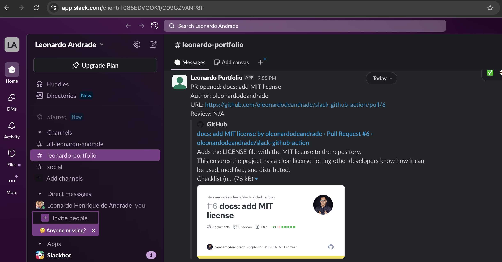
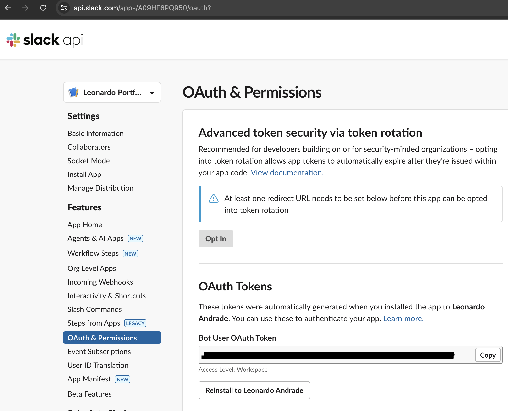
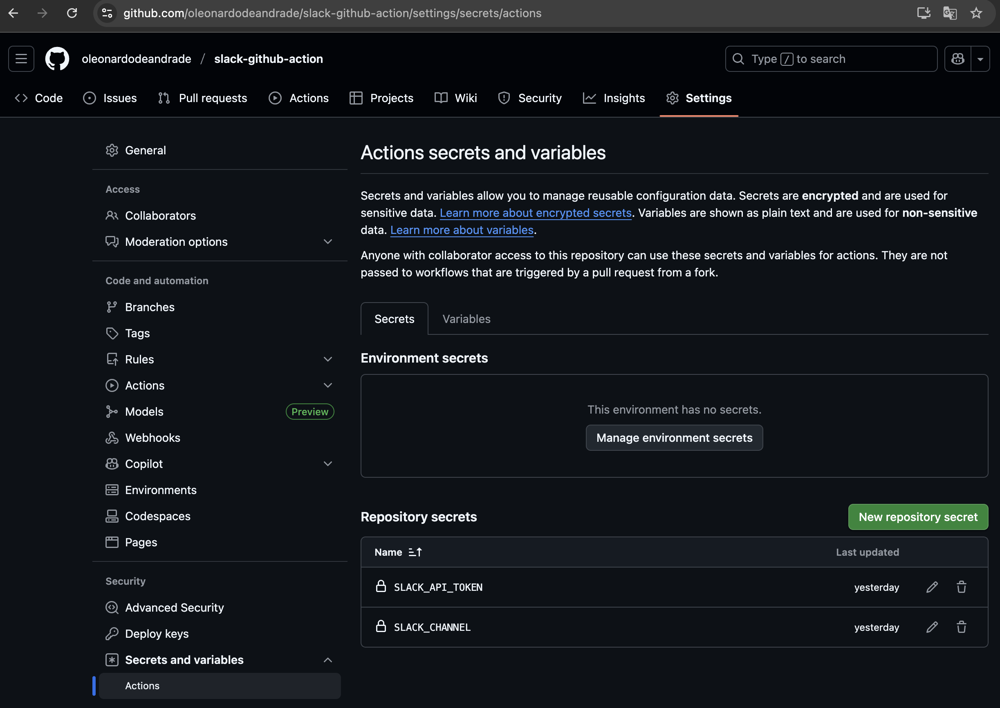
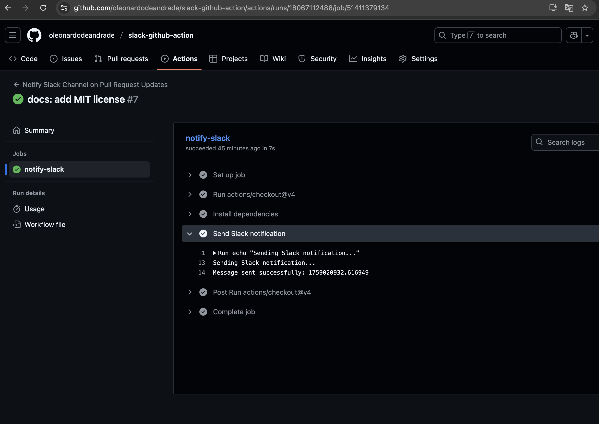

# GitHub Action – Slack Notifications for Pull Requests

This repository contains a **custom GitHub Action** that sends notifications to a Slack channel whenever Pull Requests are opened, closed, or reopened. It helps teams stay informed about PR activities directly in their Slack workspace.

[](https://github.com/oleonardodeandrade/slack-github-action/blob/main/LICENSE)
[](https://github.com/oleonardodeandrade/slack-github-action/releases)


## 📌 Overview

Streamline your development workflow by automatically notifying your team about Pull Request updates in Slack. This GitHub Action integrates seamlessly with your repository to keep everyone informed about code changes without leaving Slack.



## ✨ Features

- Real-time notifications for PR events (opened, closed, reopened)
- Detailed information including PR title, author, and direct link
- Easy setup with minimal configuration
- Secure handling of credentials through GitHub Secrets
- Customizable for different project needs

## 📂 Project Structure

```
├── .github/
│   └── workflows/
│       └── slack-notification.yml   # GitHub Actions workflow definition
├── notify.js                        # Main notification script
├── package.json                     # Project dependencies and metadata
└── README.md                        # This documentation
```

## 🚀 Quick Setup

### 1. Create a Slack App

1. Go to [Slack API](https://api.slack.com/apps) and create a new app
2. Navigate to "OAuth & Permissions" and add the `chat:write` scope
3. Install the app to your workspace and copy the Bot User OAuth Token



### 2. Configure Repository Secrets

Add these secrets to your GitHub repository under `Settings > Secrets and variables > Actions`:

| Secret Name | Value |
|-------------|-------|
| `SLACK_API_TOKEN` | Your Slack Bot User OAuth Token |
| `SLACK_CHANNEL` | The ID of the Slack channel to post notifications to |



### 3. Add Workflow to Your Repository

Create a new workflow file (`.github/workflows/slack-notification.yml`) or add the job to an existing workflow:

```yaml
name: Notify Slack on PR Events

on:
  pull_request:
    branches: [ "main" ]
    types: [opened, closed, reopened]

jobs:
  notify-slack:
    runs-on: ubuntu-latest
    steps:
      - uses: actions/checkout@v4
      
      - name: Install dependencies
        run: npm install
        
      - name: Send Slack notification
        env:
          SLACK_API_TOKEN: ${{ secrets.SLACK_API_TOKEN }}
          SLACK_CHANNEL: ${{ secrets.SLACK_CHANNEL }}
          PR_TITLE: ${{ github.event.pull_request.title }}
          PR_URL: ${{ github.event.pull_request.html_url }}
          PR_AUTHOR: ${{ github.event.pull_request.user.login }}
          PR_ACTION: ${{ github.event.action }}
        run: node notify.js
```



## 💻 Local Development

To test the script locally, clone the repository and set the required environment variables:

```bash
# Install dependencies
npm install

# Run with environment variables
SLACK_API_TOKEN=your-token SLACK_CHANNEL=your-channel PR_TITLE="Test PR" PR_URL="https://github.com" PR_AUTHOR="developer" PR_ACTION="opened" npm start
```

## 🛠️ Technical Details

### Dependencies

- [`@slack/web-api`](https://www.npmjs.com/package/@slack/web-api) - Official Slack Web API client

### Environment Variables

| Variable | Description | Required |
|----------|-------------|----------|
| `SLACK_API_TOKEN` | Slack Bot User OAuth Token | Yes |
| `SLACK_CHANNEL` | Target Slack channel ID | Yes |
| `PR_TITLE` | Pull Request title | Yes |
| `PR_URL` | Pull Request URL | Yes |
| `PR_AUTHOR` | Pull Request author username | Yes |
| `PR_ACTION` | Pull Request action (opened/closed/reopened) | Yes |

## 📈 Example Notification

The action sends formatted messages to Slack like:

```
PR opened: "Implement new feature"
Author: john-doe
URL: https://github.com/
Review: N/A
```

## 🔧 Customization

You can customize the notification message format by modifying the `notify.js` file in the root of the project:

```javascript
const result = await web.chat.postMessage({
  channel: channel,
  text: `PR ${prAction}: ${prTitle}\nAuthor: ${prAuthor}\nURL: ${prUrl}`
});
```

## 📄 License

This project is licensed under the MIT License - see the [LICENSE](LICENSE) file for details.

## 👤 Author

**Leonardo Andrade**
- GitHub: [@oleonardodeandrade](https://github.com/oleonardodeandrade)

## 🤝 Contributing

Contributions, issues, and feature requests are welcome! Feel free to check the [issues page](https://github.com/oleonardodeandrade/slack-github-action/issues).

## 🙏 Acknowledgements

- [Slack API](https://api.slack.com/) for providing excellent documentation
- [GitHub Actions](https://github.com/features/actions) for the automation platform

---

⭐ If you find this action helpful, please consider giving it a star!